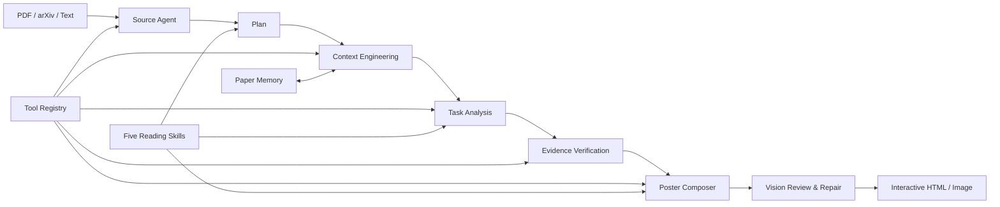

<div align="center">

# PaperDragon

### 吞下论文，吐出海报。

一个由桌面小恐龙陪伴的智能论文阅读与学术海报生成 Agent。


[快速开始](#快速开始) · [核心能力](#核心能力) · [系统架构](#系统架构) · [评测](#评测) · [路线图](#路线图)


</div>

## PaperDragon 是什么？

PaperDragon 把论文阅读、证据提取和 Poster 设计组织成一条可观察、可复核的 Agent 工作流。把 PDF 拖到桌面宠物“小阅”的嘴边，它会自动开始阅读，并在气泡中报告当前进度；分析完成后，工作台会生成一张内容完整、图表可读、来源可追溯的会议展示海报。

它并非简单地把论文摘要塞进模板。PaperDragon 会先判断论文类型，再规划阅读任务，按语义选择关键公式、方法图和实验图表，最后根据内容尺寸自适应安排版面。

```text
PDF / arXiv / Paper text
          ↓
Plan → Retrieve → Analyze → Verify → Compose
          ↓
Interactive academic poster (HTML / image)
```

## 核心能力

| 能力 | PaperDragon 的处理方式 |
| --- | --- |
| 🐲 桌面宠物入口 | 将 PDF 拖到小恐龙嘴边后自动接收、咀嚼并启动分析，无需逐步点击按钮 |
| 🧭 类型感知阅读 | 区分方法、实验、理论、系统和数据集论文，为不同论文制定不同阅读重点 |
| 🧰 Agent + Tools | PDF、LaTeX、公式、原图、表格裁剪、上下文检索、LLM 分析和视觉复核均为独立工具 |
| 🔎 证据驱动生成 | 结论绑定论文页码与原文证据，减少无依据补全和数字幻觉 |
| 🖼️ 精选视觉证据 | 方法论文优先 overview/framework/pipeline 图；实验部分优先主结果图表，避免素材堆砌 |
| 📐 自适应 Poster | 根据文字量、图片比例和表格可读宽度规划面板，降低截断和大块留白 |
| 👁️ 视觉闭环 | 视觉模型参与素材裁剪和成品复核，并将建议反馈给内容与布局修复阶段 |
| 🖱️ 可交互溯源 | 点击海报中的结论、图片或表格，可查看原文、页码和高清原图 |
| 📦 独立导出 | 导出的 HTML 保留布局、公式支持与证据交互，也可导出海报图片 |
| 📊 可观察与可评测 | 展示真实任务阶段、工具调用、重试、耗时与 Token，并提供固定离线评测集 |

## 效果流程

1. 把论文 PDF 拖到“小阅”嘴边，或在工作台输入 arXiv 链接。
2. Agent 识别论文身份与类型，生成针对性的阅读计划。
3. 工具链优先从 arXiv/LaTeX 获取公式、原图和表格，失败时再回退到精细 PDF 裁剪。
4. LLM 按任务分析内容，Verifier 检查标题、论点、实验和证据一致性。
5. Poster Composer 选择必要内容并估算面板尺寸，生成自适应布局。
6. 点击海报内容即可回到论文页码、原文证据或高清素材。

## 快速开始

### 环境要求

- Windows 10/11
- Node.js 18 或更高版本
- 一个 OpenAI-compatible 文本模型 API；视觉复核可选用 DashScope 视觉模型

### 1. 获取并安装

```powershell
git clone https://github.com/zyl-nova/PaperDragon.git
cd PaperDragon
npm install
```

### 2. 配置模型

```powershell
Copy-Item .env.example .env
```

编辑 `.env`，至少填写文本模型密钥：

```dotenv
DEEPSEEK_API_KEY=your_deepseek_api_key
OPENAI_BASE_URL=https://api.deepseek.com
OPENAI_MODEL=deepseek-chat
```

如需启用视觉裁剪检查与 Poster 视觉复核，再配置：

```dotenv
DASHSCOPE_API_KEY=your_dashscope_api_key
VISION_BASE_URL=https://dashscope.aliyuncs.com/compatible-mode/v1
VISION_MODEL=qwen-vl-max
```

> `.env` 已被 Git 忽略。不要把真实 API Key 写入 README、截图或提交记录。

### 3. 启动

桌面宠物模式：

```powershell
npm run desktop
```

仅启动网页工作台：

```powershell
npm start
```

然后访问 [http://localhost:5173](http://localhost:5173)。默认端口可通过 `PORT` 环境变量修改。

## 系统架构



### 五阶段 Agent

| 阶段 | 职责 |
| --- | --- |
| **Plan** | 拆解论文概览、问题、方法、理论、实验、结果和贡献等阅读任务 |
| **Context** | 通过 Gather、Select、Structure、Compress 为每项任务准备相关证据 |
| **Analyze** | 基于证据生成结构化内容，保留限定条件、数字和引用位置 |
| **Verify** | 独立检查标题身份、事实依据、方法逻辑和实验支撑，只修复有问题的字段 |
| **Report** | 精选视觉素材、估算内容尺寸、规划版面并生成可交互 Poster |

页面通过 NDJSON 事件流显示真实阶段。单项任务失败时会重试和补证据；模型不可用时才进入本地降级流程，而不会让整个工作流悄悄卡住。

## 工具化设计

工具由 Agent 根据输入来源和任务需要选择，而不是固定地全部串行执行。

| 工具组 | 主要实现 | 用途 |
| --- | --- | --- |
| Source | `tools/server/arxiv-source.js`、`tools/browser/pdf-parser.js` | 获取 LaTeX 源码、PDF 文本和页面信息 |
| Formula | `tools/server/latex-formulas.js`、`tools/browser/text-formulas.js` | 提取、筛选与渲染机制相关公式 |
| Figure | `tools/server/latex-figures.js`、`tools/browser/text-figures.js` | 获取论文原图、图注与语义角色 |
| Table | `tools/server/latex-tables.js`、`tools/server/pdf-table-crop.js` | 优先渲染 LaTeX 表格，必要时精细裁剪 PDF |
| Vision | `tools/server/asset-crop-vision.js`、`tools/server/poster-vision-review.js` | 检查裁剪边界、内容完整性和整体视觉质量 |
| Reasoning | `tools/server/evidence-retrieve.js`、`tools/server/llm-analyze.js`、`tools/server/llm-verify.js` | 检索证据、完成分析并进行独立复核 |
| Interaction | `tools/browser/poster-interactions.js` | 为结论和视觉素材绑定页码、原文与高清资源 |

统一的 Tool Registry 记录工具状态、耗时、摘要、重试和跳过原因。浏览器工具与服务端工具使用同一套观测协议，便于继续增加 OCR、版面检测或其他模型能力。

## Skills

项目内置五个论文阅读 Skill：

- `paper-type-classifier`：识别论文类型与应关注的证据。
- `reading-plan-builder`：根据论文特点生成阅读任务。
- `section-writing`：约束问题、动机、方法、实验和贡献的总结方式。
- `visual-evidence-planner`：决定哪些公式、方法图和结果图表值得进入 Poster。
- `poster-composer`：把内容优先级和视觉需求转化为布局计划。

Skill 负责提供任务知识与决策准则，Tool 负责执行实际操作，两者分别位于 `skills/` 与 `tools/`。

## 视觉素材与布局策略

PaperDragon 使用“语义选择 + 来源优先级 + 可读性约束”的方式组织素材：

1. **来源优先级**：arXiv/LaTeX 原始资源 → PDF 精细裁剪 → 文本生成的辅助示意图。
2. **语义去重**：方法图、关键机制和实验结果使用不同证据，避免同一图片重复出现。
3. **内容优先级**：只保留支持核心论证的公式和图表，不展示完整素材库存。
4. **可读性约束**：表格和复杂方法图获得足够宽度，不通过缩小到无法阅读来强行塞入。
5. **布局优化**：面板宽高由内容测量结果决定；允许每一横排使用不同分割比例，以减少内部留白。
6. **完整性优先**：允许整体适当扩展或留白，但正文、图注、公式和贡献不得被截断。

## 交互与导出

导出后的 HTML 是独立文件，并保留以下能力：

- 点击结论查看原文证据与论文页码。
- 点击图表查看图注、用途说明和高清原图。
- 通过 **Open paper** 打开论文链接或定位来源。
- 根据浏览器宽度重新排版，同时保持和工作区一致的内容层级。
- 在没有工作台服务的情况下继续使用证据查看交互。

## 评测

运行完整测试：

```powershell
npm test
```

运行固定离线评测：

```powershell
npm run eval
```

离线评测不会调用 LLM API，报告写入 `outputs/evaluation-report.json`，包括：

- 内容覆盖率
- 公式 F1
- 图片与表格召回率
- 证据一致性
- 数字幻觉率
- 耗时与 Token 成本

当前测试基线：**263 tests passing**。

## 项目结构

```text
PaperDragon/
├── agent/          # 阅读计划、上下文工程、分析、复核与编排
├── assets/         # 桌面宠物等视觉资源
├── desktop/        # Electron 桌面壳与系统交互
├── evaluation/     # 固定评测集、指标和报告生成
├── skills/         # 五个论文阅读与 Poster 规划 Skill
├── src/            # 工作台、布局、素材选择、交互与导出
├── tools/
│   ├── browser/    # PDF 浏览器解析、公式/图表识别和交互工具
│   └── server/     # LaTeX、视觉、LLM、检索和裁剪工具
├── index.html
└── server.js
```

更详细的工具说明见 [`tools/README.md`](tools/README.md)，演进规划见 [`docs/agent-roadmap.md`](docs/agent-roadmap.md)。

## 已知限制

- 扫描版 PDF 的文本质量仍取决于源文件，当前没有完整 OCR 管线。
- 视觉模型与文本模型的额度、延迟和可用性由所配置的服务商决定。
- 极复杂的跨页表格或组合图可能需要更多裁剪复核轮次。
- 桌面宠物模式目前优先支持 Windows。

## 路线图

- [x] Plan-and-Solve 论文阅读流程
- [x] PDF / LaTeX / 公式 / 原图 / 表格 / LLM 独立工具
- [x] 证据驱动的分析、复核与失败修补
- [x] 类型感知内容选择与自适应 Poster 布局
- [x] 桌面小恐龙拖放入口与进度气泡
- [x] 可交互证据、页码和高清原图查看
- [x] 独立 HTML 与图片导出
- [ ] OCR 与扫描版论文增强
- [ ] Poster 模板与主题编辑器
- [ ] 跨论文记忆、比较与知识库
- [ ] 可安装的桌面发行包

## 致谢

PaperDragon 的 Agent 设计与项目呈现方式受到以下优秀项目启发：

- [GenericAgent](https://github.com/lsdefine/GenericAgent)：轻量工具、Agent Loop 与 Skill 组织方式。
- [Paper2Poster](https://github.com/Paper2Poster/Paper2Poster)：科学论文到学术海报的多模态自动化与视觉闭环思路。

PaperDragon 采用独立的 Node.js/Electron 实现，重点探索桌面宠物交互、证据溯源、工具化论文阅读和自适应 HTML Poster。

---

<div align="center">
  <strong>PaperDragon</strong><br />
  Let the little dragon read the paper. You keep the insight.
</div>
